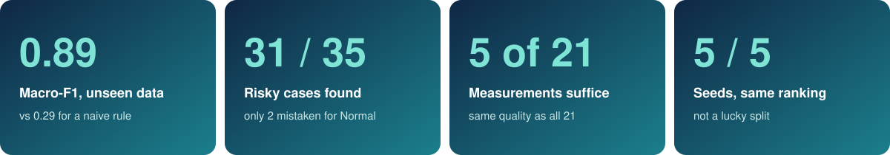
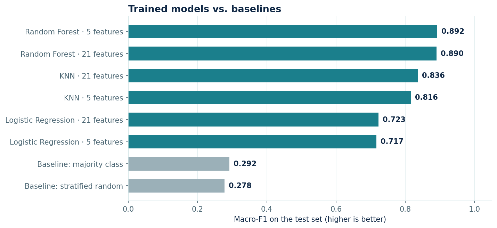
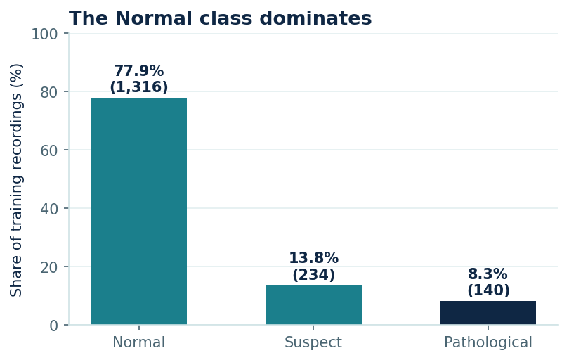
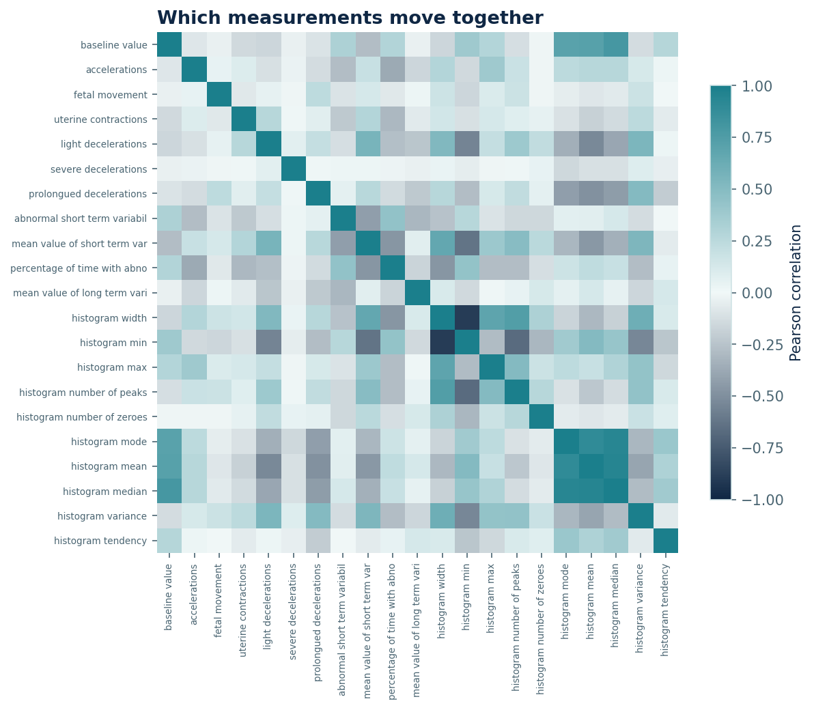
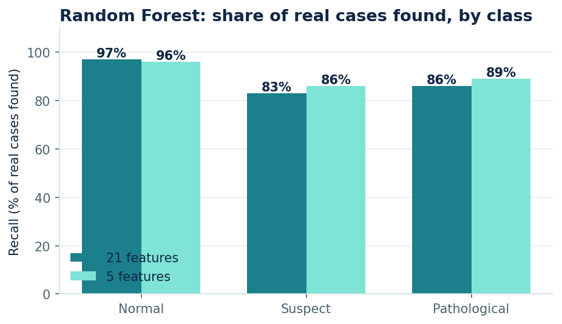
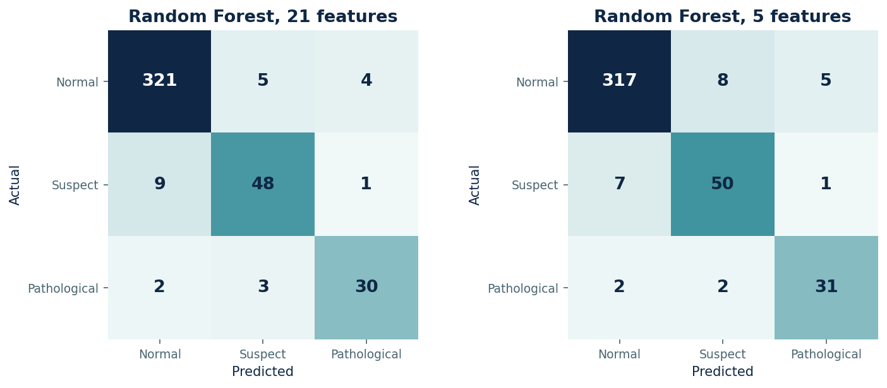
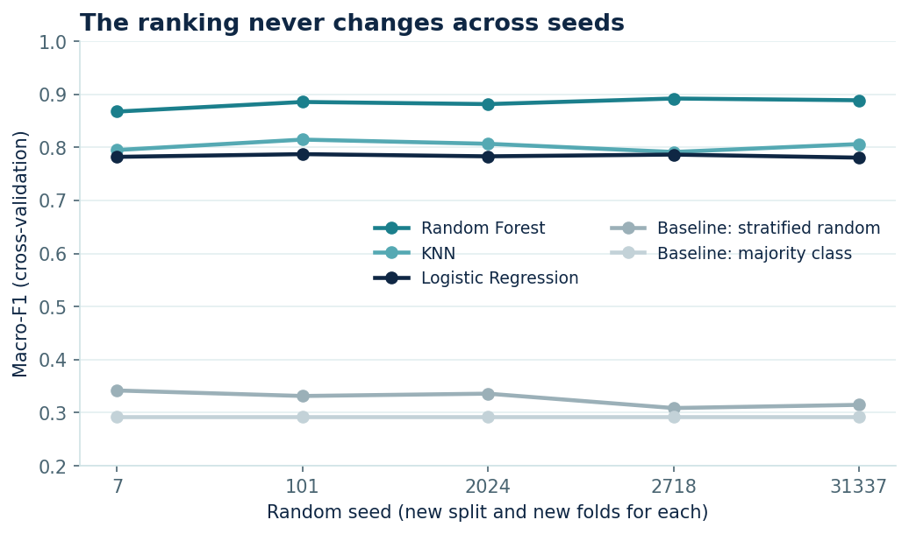
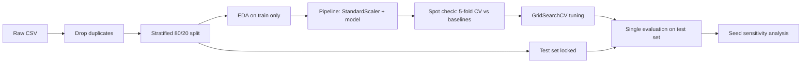

<p align="center">
  
</p>

<p align="center">
  
  
  
  
  
</p>

# Fetal Health Analysis: spotting high-risk recordings early

<p align="center">
  <a href="#project-background">Background</a> ·
  <a href="#key-metrics">Key Metrics</a> ·
  <a href="#executive-summary">Executive Summary</a> ·
  <a href="#insights-deep-dive">Insights</a> ·
  <a href="#recommendations">Recommendations</a> ·
  <a href="#limitations">Limitations</a> ·
  <a href="#repository--how-to-run">How to Run</a>
</p>

> **In one sentence:** using 21 measurements from fetal heart-rate monitoring (CTG), a Random Forest model correctly flagged **31 of the 35 high-risk cases** held back for testing and reached a score of **0.89** on a 0-1 scale, against **0.29** for a rule that always answers "healthy". Only **5 of the 21 measurements** were needed to match the full set.

<br>


## Project Background

Prenatal diagnostics cannot always rely on a specialist reviewing every monitoring trace, especially in areas with limited clinical resources. The scenario for this project is a company that builds **prenatal and maternal-fetal monitoring solutions** together with clinics and hospitals. It wants to know whether a data-driven tool can help flag the recordings that deserve a closer look.

Each recording is classified as **Normal**, **Suspect** or **Pathological**. Because the three outcomes do not carry the same cost, the analysis was built around three priorities:

- **Catch the risky cases.** Missing a pathological recording is the costliest mistake, so success is judged on how many of them are found, not on overall accuracy.
- **Keep it simple.** A tool that needs fewer measurements is cheaper and easier to deploy in low-resource settings.
- **Know what it costs to run.** Training and prediction times are measured, not assumed.

**Questions this analysis answers**

1. How well can recordings be sorted into Normal, Suspect and Pathological?
2. Which measurements carry the useful signal, and are all 21 really needed?
3. Is the result reliable, or an accident of one particular data split?
4. What would be the next step before this could be used in practice?

<br>


## Key Metrics



<br>


## Executive Summary

<p align="center">
  
</p>

| Model | Measurements used | Score (0-1) | High-risk cases found |
|---|---|:---:|:---:|
| **Random Forest** | 5 | **0.892** | **31 of 35** |
| **Random Forest** | 21 | 0.890 | 30 of 35 |
| K-Nearest Neighbors | 21 | 0.836 | 31 of 35 |
| K-Nearest Neighbors | 5 | 0.816 | 29 of 35 |
| Logistic Regression | 21 | 0.723 | 27 of 35 |
| Logistic Regression | 5 | 0.717 | 28 of 35 |
| *"Always healthy" rule* | none | *0.292* | *0 of 35* |
| *Random guessing by class share* | none | *0.278* | *1 of 35* |

*The score is the macro-F1: it gives the three classes equal weight, so a model cannot look good just by being right about the common "Normal" class.*

**What this means**

- **Random Forest is the clear winner** in both setups, and it is the only model that comes close to a useful level. KNN finds a similar number of high-risk cases, but it raises more false alarms and misses more Suspect cases, which lowers its score.
- **Five measurements are enough.** The gap between 5 and 21 measurements (0.892 vs 0.890) is smaller than the natural variation between data splits, so neither can be called better. A lighter tool looks plausible.
- **Only 2 of 35 high-risk cases were mistaken for Normal.** The other missed cases were labelled Suspect, which still draws attention.
- **The weak spot is the Suspect class**, a clinical middle ground that is inherently ambiguous.

> [!NOTE]
> This is a methodological portfolio project on a public dataset. It is **not** a validated clinical tool.

<br>


## Insights Deep-Dive

### 1. Most recordings are normal, which makes the problem tricky

<p align="center">
  
</p>

About 78% of recordings are Normal. A rule that always says "Normal" would look right nearly 8 times out of 10 and would **find no high-risk case at all**. This is why the project judges models on the score above and on the share of risky cases found, never on plain accuracy. To stop the model from simply favouring the common class, rare classes were given more weight during training instead of deleting data or inventing artificial examples.

### 2. Extreme values are the signal, not noise

Unusual recordings were identified in two independent ways (one measurement at a time, and all measurements together) and then compared:

| Rule for "unusual" | Recordings flagged | Agreement with the joint method | Expected by chance |
|---|:---:|:---:|:---:|
| Unusual on at least 1 measurement | 975 | 155 of 161 | 93 |
| Unusual on at least 3 measurements | 139 | 99 of 161 | 13 |

When a recording is unusual on several measurements at once, the two methods agree far beyond chance. And **about 41% of these unusual recordings are Pathological, against 8% in the whole dataset.** In this setting an extreme value is often exactly the warning sign, so **no outliers were removed**.

### 3. Many measurements say the same thing

<p align="center">
  
</p>

Several measurements are summaries of the same heart-rate histogram (mean, median, mode), so they move together: four pairs have a correlation above 0.85. Two independent ranking methods agree on 7 of their top 10 measurements. The reduced setup keeps these five:

1. Mean short-term variability
2. Abnormal short-term variability
3. Share of time with abnormal long-term variability
4. Histogram mean
5. Prolonged decelerations

### 4. Where the model is strong, and where it is not

<p align="center">
  
</p>

<p align="center">
  
</p>

Normal and Pathological recordings are found reliably. Suspect is the hardest class (83-86% found): by definition it sits between the other two, with the least clear boundary. Most of the Suspect cases that are missed are labelled Normal, and a few Pathological cases are labelled Suspect.

### 5. Can the ranking be trusted?

<p align="center">
  
</p>

The comparison was repeated five times with a different random split each time. **The order never changed**: Random Forest first, KNN second, Logistic Regression third. The Random Forest lead (about 0.08) is roughly eight times the variation between repeats (about 0.01), so it is not a lucky split. Scores on the small test set move by about ±0.02 between splits, so differences smaller than that are not treated as real.

### 6. What it costs to run

| | Random Forest | KNN / Logistic Regression |
|---|:---:|:---:|
| Time to tune the model | about 80-100 s | about 1 s |
| Time to score all 423 test recordings | about 20-25 ms | a few ms |

*Measured on a single-core machine: read them as relative figures. The Random Forest is the most expensive model but cheap in absolute terms; cost would matter with larger models or on low-power devices.*

<details>
<summary><b>How the analysis was built (technical details)</b></summary>

<br>



- **No data leakage:** duplicates removed before the split, scaling inside a `Pipeline`, test set used once at the end.
- **Metric:** macro-F1 guides every automatic decision; Pathological recall is reported alongside it.
- **Imbalance:** `class_weight="balanced"` instead of oversampling or undersampling.
- **Baselines:** two `DummyClassifier` strategies (majority class, stratified random).
- **Data:** 2,126 raw recordings, 13 duplicates removed, 2,113 used; 1,690 for training and 423 for testing; seed `2718`.
- **Dataset:** public CTG dataset (Ayres de Campos et al., 2000, SisPorto), also distributed on Kaggle as *Fetal Health Classification*. Check the original source for its terms of use.

</details>

<br>


## Recommendations

1. **Reduce missed risky cases before any real use.** 4 of 35 high-risk recordings were still missed. Adjusting the decision threshold to accept a few more false alarms in exchange for fewer misses is the most clinically relevant improvement.
2. **Prototype a minimal-measurement tool.** Since 5 measurements match the full set, a screening tool built on them could be cheaper to deploy, provided it is validated on data from other devices and hospitals.
3. **Try more powerful models.** Gradient boosting methods are the natural next candidates and were not tested here.
4. **Quantify the uncertainty.** With only 35 high-risk test cases, adding confidence intervals would show how much these percentages could move.

<br>


## Limitations

- **Small test set.** 423 recordings, only 35 Pathological: one more miss changes their recall by about 3 points.
- **Feature selection used the whole training set** rather than being repeated inside each cross-validation fold, so cross-validation scores for the 5-measurement setup are slightly optimistic. The test set was never used for selection.
- **One data source and no external validation.** Real-world performance may be lower.
- **Limited scope.** Three algorithms, small tuning grids, one way of handling imbalance, and the seed check covers only the default-settings comparison.
- **Timings are indicative** (single run on a single-core machine).

<br>


## Repository & How to Run

```
fetal-health-classification/
├── data/
│   └── fetal_health_dataset.csv
├── notebooks/
│   └── Fetal_Health_Classification.ipynb   # full analysis, executed, with outputs
├── images/                                 # figures used in this README
├── requirements.txt
├── LICENSE
└── README.md
```

```bash
git clone https://github.com/YOUR-USERNAME/fetal-health-classification.git
cd fetal-health-classification

python -m venv .venv
source .venv/bin/activate          # Windows: .venv\Scripts\activate
pip install -r requirements.txt

jupyter notebook notebooks/Fetal_Health_Classification.ipynb
```

The notebook takes roughly 4 minutes on a single core, most of it the Random Forest search.

## About the Author

**Alessandro Cucchi**, data analyst. I turn raw data into clear answers and explain them to the people who decide.

[](https://www.linkedin.com/in/YOUR-LINKEDIN/)
[](https://github.com/YOUR-USERNAME)
